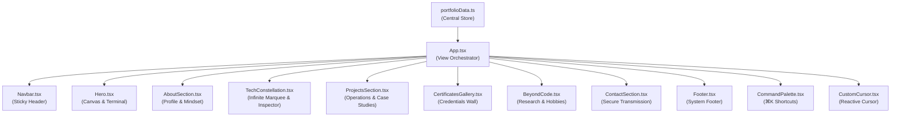

<div align="center">
  <h1>⚡ Ayushman.OS</h1>
  <p><b>Interactive Personal Tech Portfolio & Developer Operating System</b></p>
  <p>Designed and built for <b>Ayushman Sahoo</b> — Developer</p>

  <br />

  <a href="https://portfolio-ayush-man.vercel.app" target="_blank">
    
  </a>
  <a href="https://github.com/Ayushmansahoo098/Portfolio">
    
  </a>
  <a href="https://github.com/Ayushmansahoo098/Portfolio">
    
  </a>
  <a href="https://github.com/Ayushmansahoo098/Portfolio">
    
  </a>
</div>

---

## 🌐 Live Deployment

🚀 **Live Website**: [https://portfolio-ayush-man.vercel.app](https://portfolio-ayush-man.vercel.app)

---

## 🌟 Overview

**Ayushman.OS** is an interactive personal tech portfolio designed to communicate technical competence, curiosity, and systematic execution.

### Visual & Aesthetic Identity
- **Pitch Black Background (`#000000`)**: Deep graphite noise texture overlay and fine grid system.
- **Burgundy & Crimson Accents (`#6D001A` / `#990026` / `#E01E43`)**: Rich, luxurious glows, interactive button states, canvas particle networks, and active section indicators.
- **Permanently Sticky Header**: Glassmorphic floating top navbar remaining visible continuously throughout scrolling.

---

## ✨ Key Features

- **⚡ Cinematic Boot Sequence**: Skippable terminal initialization sequence (`INITIALIZING AYUSHMAN.OS ... SYSTEM READY`).
- **🎯 Contextual Reactive Cursor**: Glowing desktop cursor with contextual label badges (`VIEW OPERATION`, `OPEN GITHUB`, `SEND MESSAGE`) and automatic touch device fallback.
- **💻 Interactive Developer Terminal**: Built-in CLI panel supporting commands:
  - `$ whoami` — Overview & bio
  - `$ skills` — Core tech stack breakdown
  - `$ projects` — Featured open-source projects
  - `$ contact` — Social links
  - `$ sudo hire ayushman` — *Unlocks secret ACCESS GRANTED mode*
- **🔄 Infinite Scrolling Tech Stack Ticker**: Edge-to-edge dual-track infinite marquee with vertical white line separators, live search filtering, and pause-on-hover inspector.
- **🚀 Featured Operations**: Production systems and AI agents featuring Ayushman's pinned GitHub repositories:
  - **[Telco-Root-cause-analysis](https://github.com/Ayushmansahoo098/Telco-Root-cause-analysis)**: AI 5G network outage root cause analysis platform using graph reasoning & Groq Llama 3.3 70B.
  - **[Kairo-Event-Discovery-app](https://github.com/Ayushmansahoo098/Kairo-Event-Discovery-app)**: Real-time event discovery aggregator indexing 500+ hackathons via Playwright scrapers.
  - **[pdf-to-quiz-nlp](https://github.com/Ayushmansahoo098/pdf-to-quiz-nlp)**: Offline NLP system parsing PDFs into interactive quizzes using spaCy & TF-IDF.
  - **[SafeRoute](https://github.com/Ayushmansahoo098/SafeRoute)**: Safety navigation web app calculating safe travel routes based on location intelligence.
- **📜 3D Perspective Credentials Wall**: Verified credentials from **HackerRank**, **CTTC (MSME)**, and **Oracle** (Agentic AI Specialist).
- **⌨️ Command Palette (`⌘K` / `Ctrl+K`)**: Rapid navigation, action shortcuts, resume download, and terminal triggers.

---

## 🏗️ System Architecture & File Structure

```text
Portfolio/
├── src/
│   ├── components/              # Modular UI Components & Page Sections
│   │   ├── Navbar.tsx             # Floating glassmorphic sticky header & navigation drawer
│   │   ├── Hero.tsx               # Hero banner with dynamic HTML5 canvas particle network
│   │   ├── AboutSection.tsx        # Personal narrative, profile panel, & engineering focus
│   │   ├── TechConstellation.tsx   # Dual-track infinite marquee ticker, search, & inspector modal
│   │   ├── ProjectsSection.tsx     # Featured operations grid & interactive case study modal
│   │   ├── CertificatesGallery.tsx # 3D perspective verified credentials wall
│   │   ├── BeyondCode.tsx         # Creative engineering pursuits & research interests
│   │   ├── ContactSection.tsx      # Secure communications form & direct contact links
│   │   ├── DeveloperTerminal.tsx   # Interactive CLI terminal (whoami, skills, projects, sudo)
│   │   ├── CommandPalette.tsx      # Command palette overlay (⌘K / Ctrl+K) for quick actions
│   │   ├── CustomCursor.tsx        # Glowing reactive cursor with contextual label badges
│   │   ├── LoadingScreen.tsx       # Skippable cinematic boot initialization sequence
│   │   ├── Footer.tsx              # System status, copyright notice, & social links
│   │   └── EasterEggs.tsx          # Secret terminal unlock modal & interactive highlights
│   │
│   ├── data/
│   │   └── portfolioData.ts       # Centralized TypeScript store (Projects, Skills, Certs, Bio)
│   │
│   ├── App.tsx                    # Main layout coordinator, section flow, & modal state
│   ├── index.css                  # Tailwind directives, custom scrollbars, & marquee keyframes
│   └── main.tsx                   # React 18 DOM entry point
│
├── index.html                   # HTML5 entry document & SEO meta tags
├── tailwind.config.js           # Theme configuration (Black & Burgundy color palette)
├── vite.config.ts               # Vite build tooling & path configuration
├── package.json                 # Project dependencies & build scripts
└── README.md                    # Technical documentation & system architecture
```

### Data Flow & Component Architecture



---

## 🛠️ Technology Stack

| Layer | Technologies |
| :--- | :--- |
| **Framework** | React 18, Vite, TypeScript |
| **Styling** | Tailwind CSS, Custom CSS Variables, Glassmorphism, Noise Overlays |
| **Animations** | Framer Motion, HTML5 Canvas API |
| **Icons** | Lucide React |
| **Data Layer** | Modular TypeScript central store (`src/data/portfolioData.ts`) |

---

## 🚀 Quick Start & Local Development

### 1. Clone the repository
```bash
git clone https://github.com/Ayushmansahoo098/Portfolio.git
cd Portfolio
```

### 2. Install dependencies
```bash
npm install
```

### 3. Start development server
```bash
npm run dev
```
Open [http://localhost:5173](http://localhost:5173) in your browser.

### 4. Build for production
```bash
npm run build
```

---

## 👤 Author

**Ayushman Sahoo**
- **GitHub**: [@Ayushmansahoo098](https://github.com/Ayushmansahoo098)
- **LinkedIn**: [linkedin.com/in/ayush-man-sahoo](https://linkedin.com/in/ayush-man-sahoo)
- **Email**: ayushmansahoo098@gmail.com

---

<div align="center">
  <sub>© 2026 Ayushman Sahoo. Designed as Ayushman.OS</sub>
</div>
